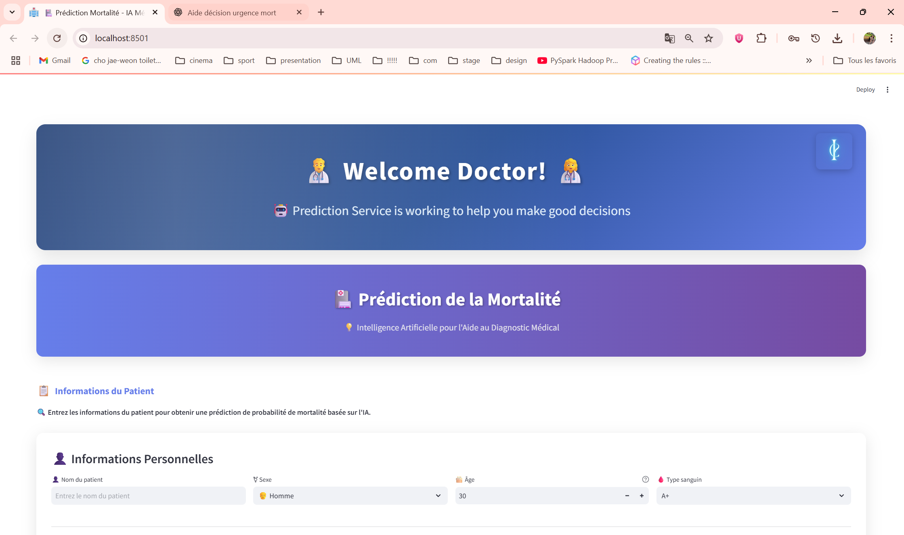
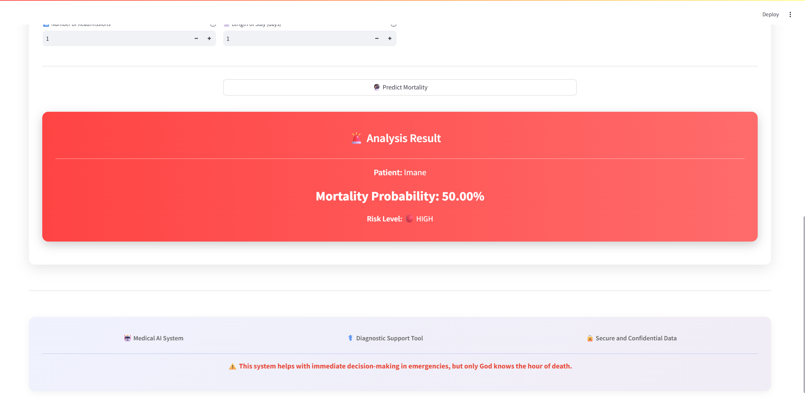

#🏥 Hospital AI Project

Projet d’intelligence artificielle pour la prédiction de la mortalité des patients hospitalisés à partir de données médicales. Il combine un modèle IA (Random Forest) et une interface simple avec Streamlit + un dashboard Power BI intégré.

#📁 Architecture du projet
```bash
hospital-ai-project/
│
├── app.py                             # Interface utilisateur (Streamlit)
├── requirements.txt                  # Dépendances Python
│
├── data/
│   ├── BaseMedicale_Talend.xlsx      # Données brutes Excel
│   ├── cleaned_data.csv              # Données nettoyées
│   └── model/
│       ├── random_forest_model.pkl   # Modèle IA entraîné
│       └── feature_encoder.pkl       # Encodeur utilisé à l'entraînement
│
├── notebooks/
│   ├―― 1_data_cleaning.ipynb         # Nettoyage des données
│   ├―― 2_feature_engineering.ipynb  # Feature engineering + encodage
│   └―― 3_model_training.ipynb        # Entraînement du modèle RandomForest
│
├── src/
│   ├―― model.py                      # Fonction de prédiction IA
│   ├―― database.py                   # Chargement des données utiles
│   └―― utils.py                      # Fonctions auxiliaires
│
├── dashboard/
│   ├―― assets/
│   │   ├―― 1.png                     # Image du dashboard Power BI
│   │   └―― hospital_dashboard.pbix   # Fichier Power BI complet
│   └―― powerful_embed.py            # Script pour afficher le dashboard dans Streamlit
│
└―― README.md                         # Fichier de documentation
```
#🚀 Lancer l'application


Assurez-vous d'avoir Python 3.8+ installé.

## Structure du projet

- `data/` : Contient les données brutes et nettoyées
- `notebooks/` : Notebooks pour le nettoyage, feature engineering et entraînement
- `src/` : Code source Python

## Installation


1. Cloner le dépôt
```bash
git clone https://github.com/ton-nom/hospital-ai-project.git
cd hospital-ai-project
```
2. Créer un environnement virtuel

```bash
python -m venv venv
venv\Scripts\activate     # Windows
# source venv/bin/activate  # macOS/Linux
```

3. Installer les dépendances
```bash
pip install -r requirements.txt
```

4. Lancer Streamlit
```bash
streamlit run app.py
```
#🧐 Fonctionnement de l’IA


-L'utilisateur entre les informations médicales dans l'interface (âge, maladie, médicaments, etc.).
-Ces données sont converties en DataFrame puis encodées via feature_encoder.pkl.
-Le modèle random_forest_model.pkl fait une prédiction binaire (survie ou décès).
-Une probabilité (%) de l'issue est aussi retournée.
-Le tout est affiché dans l’interface via Streamlit.

#📊 Dashboard Power BI intégré

Une version visuelle des KPI hospitaliers est disponible via Power BI, intégrée dans l'app.

#🌐 Exemple d'intégration
```bash
from dashboard.powerful_embed import display_dashboard
display_dashboard()
```


#📸 Aperçus

Interface IA (Streamlit)




